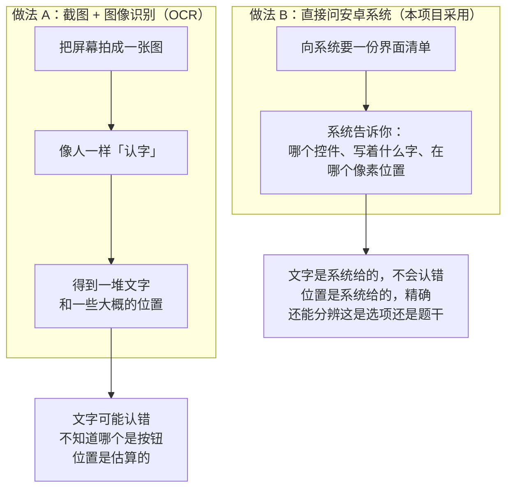
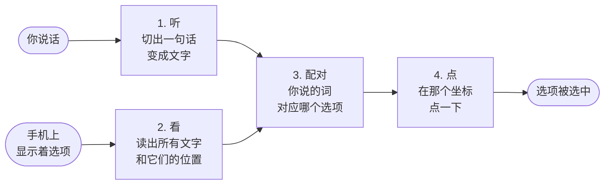
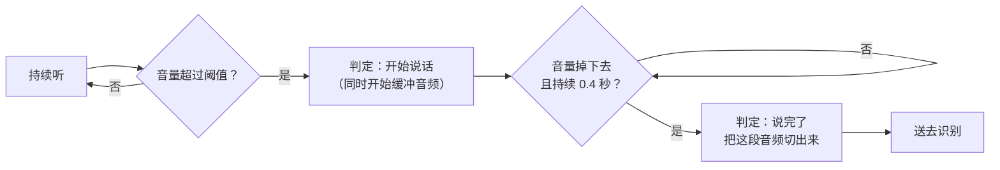
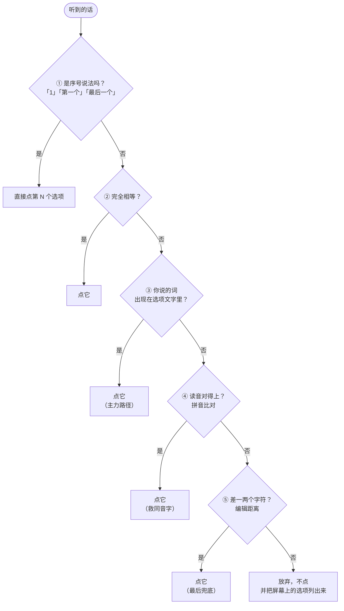
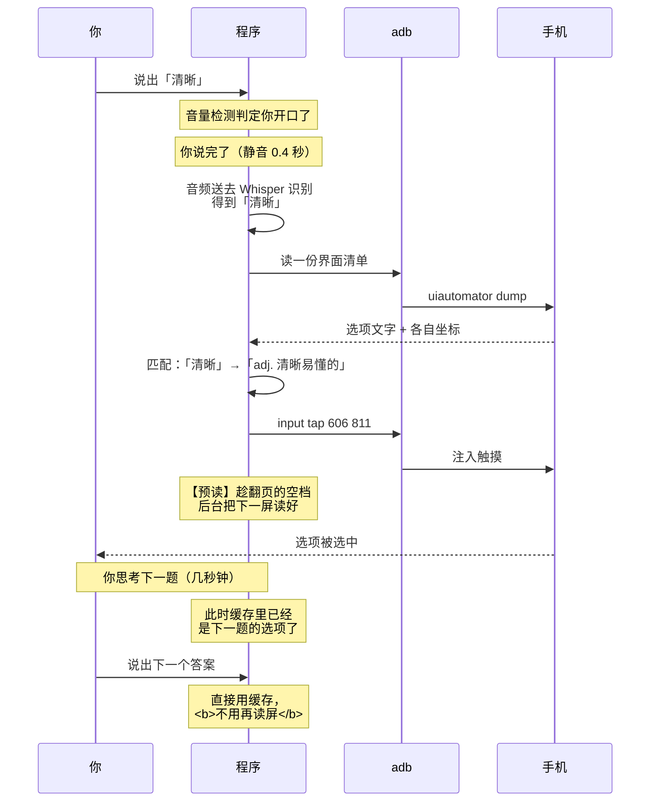
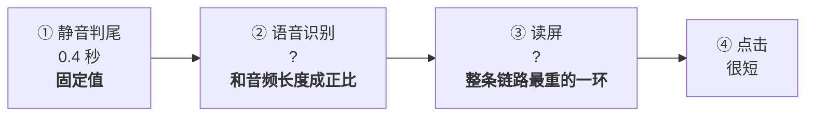
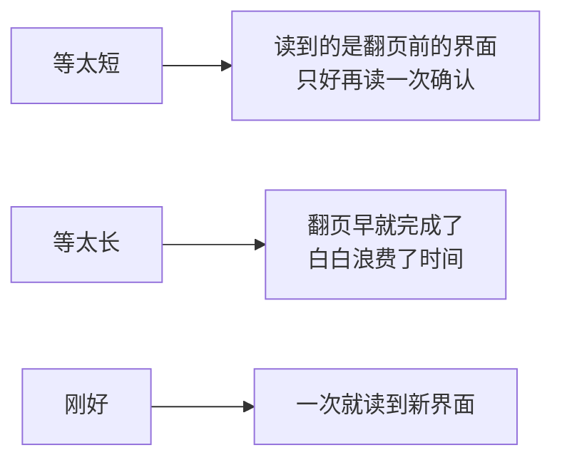
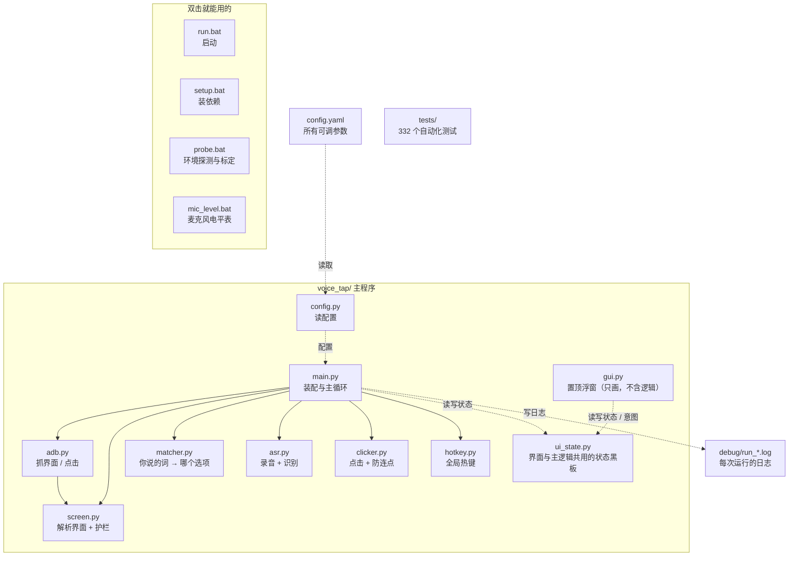

# 声控手机助手 —— 原理与实现

这份文档讲两件事：**它到底怎么工作的**，以及**时间花在哪里**。

- 前三章不需要技术背景，一看就懂
- **第四、六章是给你判断优化方向用的** —— 那里有耗时分解和已知瓶颈
- 带 ⚙️ 的小节是内部细节，不关心可以跳过

---

## 零、一句话

你说出一个词，程序在手机屏幕上找到那个词，然后点它。全程不动鼠标。

这四个动作分别是：**听 → 看 → 配对 → 点**。下面逐个拆开。

---

## 一、核心思路：不「看」屏幕，而是「问」手机

这是整个项目最重要的一个决定，先讲清楚它。

### 两条路可以走



做法 B 用的是安卓自带的**无障碍服务（Accessibility Service）**。它本来是给视障人士用的 —— 让手机能"念"出屏幕上有什么。我们要的恰好就是这份"念出来的结果"。

### 系统返回的东西长这样

向手机要一份界面清单，拿到的是一个 XML 文件。里面一个控件的长相是：

```xml
<node text="adj. 清晰易懂的"
      resource-id="com.enhance.greapp:id/tv_question"
      class="android.widget.TextView"
      clickable="false"
      bounds="[50,736][1162,886]" />
```

四样东西，全都有用：

| 字段 | 是什么 | 我们拿它干什么 |
|---|---|---|
| `text` | 控件上写的字 | **判断你说的词在不在里面** |
| `resource-id` | 这个控件的"身份证号"，写 App 的人给它起的名字 | **区分哪个是选项、哪个是题干** |
| `bounds` | 它在屏幕上的范围，单位像素 | **决定点哪儿** |
| `clickable` | 它本身能不能被点 | 参考（这个不太可靠，见 5.3） |

> **最关键的一点：位置是系统报出来的。**
> 不是我们算的，不是看图猜的。所以它不会"认错字"也不会"估错位置" ——
> 这是整套方案准确性的来源。

---

## 二、四个环节



### 2.1 听 —— 把声音变成文字

要解决一个很实际的问题：**我怎么知道你什么时候说完了？**

不可能你说完还一直录着等。做法是盯着音量：



那个"阈值"不是拍脑袋定的，是**按你的麦克风实测标定**出来的：

| 测出来的东西 | 数值 |
|---|---|
| 安静时的环境噪音 | 0.0018 |
| 说话时的音量峰值 | 0.113 |
| 定下来的判定阈值 | **0.0246** |

阈值取在中间偏下 —— 比环境噪音高十几倍（不会被背景声误触发），又远低于说话音量（不会漏掉你说的话）。

切出来的那段音频交给 **Whisper**（语音识别模型）。它**完全在你电脑上跑，不联网、不上传录音**。第一次运行要下载约 480MB 的模型文件，之后就一直在本地了。

### 2.2 看 —— 读出手机上的文字和位置

```bash
adb shell uiautomator dump        # 要一份界面清单
adb shell input tap 606 811       # 在那个位置点一下
```

`adb`（Android Debug Bridge）是电脑和安卓手机之间的标准通道，你的 scrcpy 用的也是它。

拿到界面清单之后有个**关键问题**：GRE3000 的界面上文字很多 ——

```
题干：degrade
选项：adj. 清晰易懂的 / adj. 阴郁的，闷闷不乐的 / adj. 骄奢淫逸的…
进度：51 / 200
按钮：上一题
底部：阅读：据词选中义
```

**我们只要"选项"这四个（加"不记得了"），其他的都得排除掉。**

靠什么区分？靠身份证号：

| 身份证号（resource-id） | 是什么 | 要不要 |
|---|---|---|
| `tv_word` | **题干** | ❌ 必须排除 |
| `tv_question` | **每一个选项** | ✅ 只留这个 |
| `tv_title` | 进度 "51 / 200" | ❌ |
| `tv_question_type` | 底部题型标签 | ❌ |

> **为什么题干必须排除？**
> 题干里**很可能出现和某个选项一模一样的词**。比如题面是一段英文释义，
> 而选项里有那个释义中用到的单词。如果不排除，你说那个词，
> 程序有可能点到上面的题干上去 —— 点了、没报错、但是点错了。

### 2.3 配对 —— 你说的话，对应哪个选项

**这是最需要打磨的一环。** 因为你说的和屏幕上写的，通常不会完全一样：

- 屏幕上写「adj. 清晰易懂的」，你只会说「清晰」
- 屏幕上写「骄奢淫逸的」，语音识别可能听成「骄奢淫意」

所以匹配是**层层降级**的，前面没中才试后面：



> **2026-09-28 起**：第 ① 级（说序号）和「说下一题」归同一个总开关 `voice.commands` 管，
> **默认关**。依据是真机日志：环境杂音或手机自己念出的词被识别成「第一个」（语言还判成
> 了英文），程序就当序号点了一下。关着时直接从第 ② 级开始；说「选项里的词」不受影响。

第 ③ 级承担了绝大多数工作。因为**你只说选项里的一小部分，话说得短，语音识别反而更不容易听错** —— 这比要求你说完整更可靠。

第 ④ 级是给中文准备的：同音字字形对不上但读音一致，比字形比对管用。

**第 ⑤ 级之后没有第 ⑥ 级。** 匹配不上就是不点，宁可你重说一遍 —— 原因见 5.2。

### 2.4 点 —— 注入一次真实触摸

```bash
adb shell input tap 606 811
```

就这一条命令。它注入的是**真实的触摸事件**，和你的手指点屏幕、用鼠标在 scrcpy 里点，走的是同一条路。所以只要坐标对，就一定能点中。

---

## 三、完整流程

把上面四步串起来，一次完整的"答题"是这样：



**注意最后四行** —— 这是最近加的一项优化，也是目前省时间最多的一处：

点下去之后 App 会翻页，翻页那一小段时间程序是空闲的，正好拿来读下一屏。
等你思考完再开口时，界面数据已经在手上了，**一点等待都没有**。

这一招之所以可行，是因为「读屏」和「思考」可以重叠 —— 读屏慢没关系，只要它在你思考的那几秒里做完就行。

---

## 四、时间花在哪里 ⚙️

这一章是给优化用的。先说清楚**哪里重、哪里轻**。

### 一次完整交互的时间构成



### 各项的实际数值

| 环节 | 耗时 | 说明 |
|---|---|---|
| ① 静音判尾 | **0.4 秒** | 配置值，固定。这是"我无法立刻知道你何时说完"的代价 |
| ② 语音识别 | **待测** | 日志里的「识别耗时」就是它。历史实测：喂 5 秒音频约 1.8～3.8 秒（两次参数不同） |
| ③ 读屏 | **待测** | 日志会说明这一项是「当场读屏 N 毫秒」还是「预读（没读屏）」 |
| ④ 点击 | **很短** | 一条 adb 命令 |

**③ 这一项现在大多数时候是 0** —— 因为点击之后已经在后台读好了。
只有预读整个没做成（两次读屏都失败）、或者结果放太久过期了，才会当场读一次。

> **你的日志里已经有 ② 和 ③ 的真实数字了。**
> 每次运行都会写一份到 `debug\run_<时间戳>.log`，里面长这样：
>
> ```
> （界面来源：预读，1.2 秒前读好的（没读屏））
> （音频 1.20 秒，识别耗时 0.85 秒，语言 zh）
> [预读] 读到新界面，距点击 420 毫秒（本次读屏 380 毫秒）
> ```
>
> 第三行告诉你**点击之后隔了多久才真正翻页**，这是调等待时长的依据。
>
> 想快速看统计，在项目目录下执行：
> ```
> findstr /C:"预读" /C:"界面来源" /C:"识别耗时" debug\run_*.log
> ```

### 怎么调「点击后等多久才读」

预读有个两难的取舍：



**不需要你猜。** 程序不是"等固定时间就当翻好了"，而是**读到和点击前不一样了才算数**。
所以等待时间主要影响效率：调得太小、又碰上翻页慢，第二次读到的可能还是翻页前那一屏
（预读最多读两次，第二次就得收下）—— 也就是上面「等太短」那一格。

日志里这一行就是答案：

```
[预读] 读到新界面，距点击 420 毫秒（本次读屏 380 毫秒）
```

看到「读到新界面，距点击 420 毫秒」就说明等待时间够；若先来一句
「还是旧界面，再读一次确认」，就说明 `click_delay_ms` 该调大一点。
**预读最多读两次** —— 第二次无论读到什么都收下（连着两次一样，那就是当前屏幕了，
再读只是白耗时间、还挡住你的按键）。所以不会再有第 3、4 次。
全都在 `config.yaml` 的 `prefetch` 段里。

### 为什么读屏最重

`uiautomator dump` 不是"读一下内存"那么简单 —— 它要在**手机上**启动一个 Java 虚拟机、遍历整个界面的控件树、再把结果序列化成 XML 传回来。

已经做过一次优化：原来要**两次** adb 往返（先让手机存成文件、再取回来），现在合并成一条命令，少一次进程创建。

但大头还在。**这是目前最值得动的环节。**

### 端到端大致量级

把上面加起来，从你说完话到手指落下，**大约 1.5～3 秒**（具体取决于你机器上的实测值）。其中相当一部分已经被"预抓取"和你说话的时间重叠掉了。

---

## 五、六个关键设计决策 ⚙️

这一章讲**为什么有些地方是那样做的** —— 大部分是踩过坑之后改的。想优化的话，先知道哪些是"有理由的"，别不小心改回去。

### 5.1 为什么不用固定坐标

因为**选项的位置会随题干长短整体漂移**。实测数据：

| 题干 | 字符数 | 第 4 个选项的纵坐标 |
|---|---|---|
| `degrade` | 7 | 1375 |
| `to feel or express annoyance or ill will at` | 43 | 1375 |
| `standing out conspicuously : prominent; …` | ≈70 | **1418** |

题干 ≤43 个字符时位置纹丝不动，≈70 个字符时**整体下移 43 像素**。

选项行高只有 150，中心到行边界仅 75 像素 —— **43 像素已经吃掉大半余量**，题干再长就可能跨到相邻选项上。

关键不在于"会漂"，而在于**漂了的后果**：程序会照点，不报错，你看不出来点错了。

所以选项一律**每次读屏取实时坐标**。要提速就优化读屏本身，而不是绕过它。

### 5.2 匹配不上为什么宁可放弃

因为**代价不对称**：点错会被判错，漏点只要重说一遍。

这条原则统领了很多设计 —— 包括拒绝在别的 App 上点击（见 5.3）。

### 5.3 为什么 `clickable` 标记不能信

理论上每个控件有个"我能不能被点"的标记。**但 GRE3000 的选项全都是 `false`。**

原因：这些选项是列表控件（RecyclerView）的子项，点击由列表统一处理，所以子项自己不需要标"可点"。这是安卓上很常见的写法。

而**这个标记只影响无障碍工具，不影响真实触摸**。`input tap` 注入的是真实触摸，列表照样响应。

> **教训：判断能不能点，看的是"这个文字有没有坐标"，不是看 `clickable` 标记。**

### 5.4 为什么要有"前台应用护栏"

因为**这个工具是盲的** —— 你看不见程序看到了什么。

如果手机停在别的 App 上而你以为在答题界面，程序会把它看到的会话列表当成选项去点，后果不可预期。所以每次点击前都要确认：前台应用是不是 GRE3000、界面上有没有选项。

代价极低，但能杜绝一整类事故。

### 5.5 小键盘为什么不能简单地监听数字键

直觉做法是监听 `1`~`9` 这几个键。**但那样会把你在任何程序里打的数字都抢走。**

原因：底层的键盘库把**小键盘数字和主键盘数字映射成了同一个键名**，光看名字区分不了。

正确做法是拿底层事件、读它上面的"这是不是小键盘"标志（库根据扫描码算出来的）。这样**主键盘完全不受影响**。

> 附带一个小坑：NumLock 没开时，小键盘产生的是方向键事件。程序检测到会给一次提示，而不是默默失灵。

### 5.6 为什么录音代码写得那么啰嗦

因为最朴素的写法会**把程序卡死**。

`sd.rec()` + `sd.wait()` 这一对，在某些 Windows 音频设备（尤其 USB 麦克风）上会**永久阻塞，不报错也不返回**。已经踩过一次：程序卡在"正在测量环境底噪"那一步，窗口毫无反应。

现在的写法是回调式采集 + 硬超时 —— 最坏等几秒就报错退出。

---

## 六、可以优化的地方 ⚙️

按我的判断排个序。

### 6.1 读屏 —— 已经做了一轮，还能再挖 ⚙️

**现状**：读屏本身仍然是链路上最重的一环。但**大多数时候你感觉不到它** ——
点击之后已经在后台读好了下一屏，等你开口时直接就能用。

已经做的两项：

| 做法 | 效果 |
|---|---|
| 点击后预读（和"思考下一题"的时间重叠） | 一次交互省掉一整次读屏的等待 |
| 把两次 adb 往返合并成一条命令 | 省掉一次进程创建（Windows 上每次 adb 调用都是） |

**还能挖的方向**：

- 查一下 `uiautomator dump` 有没有更轻的替代参数（比如 `--compressed`），值得实测一次
- 现在的预读是**事后补**（点完才读）。如果可以接受稍微复杂一点的做法，
  还能常驻一个无障碍连接直接订阅界面变化 —— 但那要另装一个手机端 App
- **先看日志**：如果 ③ 这一项大多数时候已经是「预读（没读屏）」，
  那这里就没多少可挖的了，力气该花到语音识别上

### 6.2 语音识别（可能是现在最值得动的）⚙️

**现状**：识别耗时和音频长度成正比，而且**没有办法像读屏那样"藏"到别的时间里去** ——
它必须等你说完才能开始。

已经做过三项：裁掉首尾静音、用最快解码方式、模型 int8 量化。

**可以试的方向**：

- 换更小的模型（`config.yaml` 里 `asr.model` 改 `base`）—— 参数量降到约 1/3，**见效最大**
- 关掉内置的静音过滤 —— 我们自己在送进模型前已经裁过一遍了，那层可能是重复劳动
- 你的日志里「识别耗时」是实测值，先看它有多大再决定

**为什么不做流式识别**（很多人会想到这个）：商业语音识别确实边听边出字。
但 Whisper 是"整段识别"的模型，硬要做流式得反复对重叠的音频跑模型，
在 CPU 上基本不可行。而且流式也省不掉"判断你说完了"这一步 ——
它买到的是观感上的即时反馈，不是更快的最终答案。

### 6.3 静音判尾（0.4 秒，固定成本）

你说完之后要等 0.4 秒安静才切句。调小能更快，但**容易把你话中间的停顿当成结尾**，把一句话切成两半。

这个值是速度和可靠性的直接交换，可以在 `config.yaml` 里调 `silence_duration` 亲自试试。

### 6.4 识别准确率

如果发现"说了没反应"或者"总点错"，看日志里的 `[听到]` 那一行 —— 它直接告诉你识别成了什么。

- 如果是**识别错了** → 考虑换大模型，或者**直接说序号**（「1」「第二个」，需先打开
  `voice.commands`，默认关）—— 数字几乎不可能听错
- 如果是**识别对了但没匹配上** → 看日志里列出的选项，确认你要说的词确实在里面

### 6.5 已知的覆盖范围限制

- **目前只支持 GRE3000** —— 靠它的身份证号精确定位选项。其他 App 会被前台护栏拒绝（这是有意的）
- **多邻国这类自绘界面**读不到文字（它的界面不是标准控件画的），需要接入图像识别才能支持
- **换手机或改分辨率**后需要重新跑一次标定

---

## 七、怎么读日志

每次运行都会写一份完整日志到 `debug\run_<时间戳>.log`。出问题时看这几行就够：

```
[听到] '清晰'   置信度 -0.40            ← 语音识别成了什么
[屏幕] 题干：degrade                    ← 程序看到的界面
[屏幕] 选项：adj. 清晰易懂的 / adj. 阴郁的 / ...
（界面来源：预读，1.2 秒前读好的（没读屏）） ← 这次读屏了吗
（音频 1.20 秒，识别耗时 0.85 秒）        ← 时间花在哪
[匹配] 子串命中：'adj. 清晰易懂的' → 点击坐标 (606, 811)
[点击] 完成
[预读] 读到新界面，距点击 420 毫秒（本次读屏 380 毫秒）  ← 翻页花了多久
```

**没点成功时，看一眼 `[匹配]` 那行就知道是哪种情况：**

| 日志里看到什么 | 说明 | 怎么办 |
|---|---|---|
| `[匹配] 没找到 'xxx'` | 识别对了，但屏幕上没这个词 | 看它列出的选项，换个说法 |
| `[听到]` 那行的词不对 | 语音识别错了 | 换大模型，或者直接说序号（需先打开 `voice.commands`） |
| `[屏幕] 当前不在 GRE3000…` | 手机停在别的 App 上了 | 切回答题界面 |
| `[屏幕] 当前界面上只有 0 个选项` | 不在答题页 | 切到答题页 |

---

## 附：文件都是干什么的


